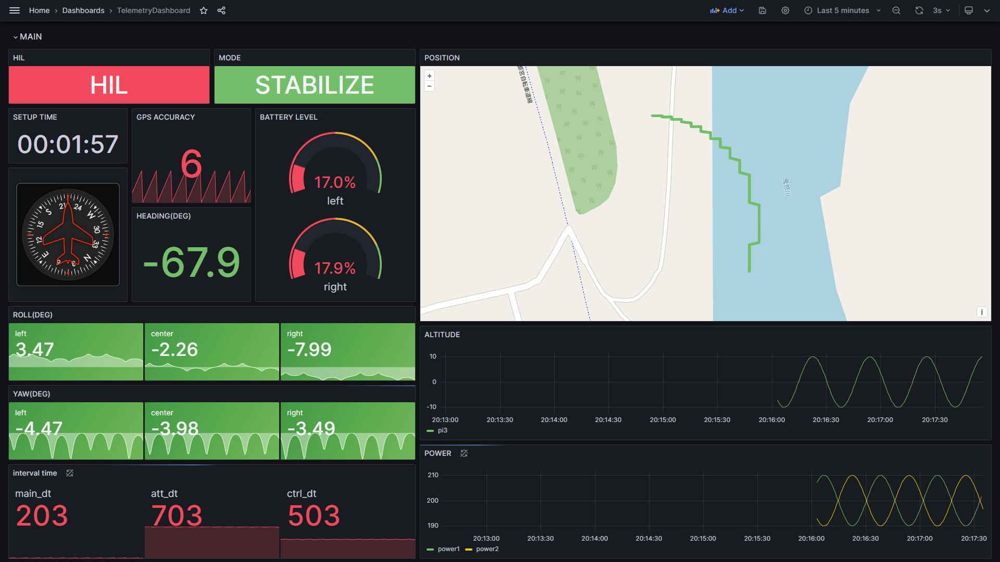

# GAIA ground station

*G*rafana *A*nd *I*nfluxDB based data *A*nalize system

## システム概要
マイコンからのデータをGrafanaによって可視化するソフトウェア

- 通信の流れ
    - MCU <-(USBserial)> Python3 <-(https)-> InfluxDB Cloud serverless <-(https / FlightSQL)-> Grafana
- MCU
    - Teensy4.1
    - COBS変換してシリアル通信でPCへ送信
- Python
    - venv仮想環境
    - シリアル通信でのデータ読み取り
    - COBSデコード
    - influxdb line protocolへの変換
    - databaseへの書き込み

## How To Use ( for server )
- Grafanaはリモートサーバー上に立てることを想定している
- サーバー上には本リポジトリのdocker-compose.yml及びdocker以下があればOK
- requirements
    - docker及びdocker-composeのinstall
- 基本的にはdocker-compose up -dでサービスが走り出す
    - localhostの8085にport forwardをしているので、インターネット経由では"http://[外部IPアドレス]:8085"でアクセス可能
    - 必要に応じてドメイン取得やssl化を行う
- 注意事項
    - grafanaのdataを./docker/grafana/data以下にマウントしている都合上、dockerに書き込み権限を付与する必要がある
    - chmod -R 777 ./docker/grafana/dataが一番楽

## How To Use ( in local )

### Grafana環境
- docker compose up -d
    - grafanaの立ち上げ
        - そのうちlocalでdbも立てられるようにしたい
- "http://localhost:8086" にブラウザでアクセス
- docker compose down
    - dockerコンテナの終了
    - データは永続化される
### influxdb3-python環境(初期設定)
- OSに依らず共通
- databaseへのAPItokenを環境変数'INFLUX_TOKEN'に設定する
    - tokenは誰かに共有してもらおう
- serialportの設定
    - windowsなら'COM××'
    - ubuntuなら'/dev/ttyACM0'のように指定される
- venv仮想環境の設定と必要ライブラリのインストール
    - python3 -m venv .venv
        - 仮想環境の作成
    - ./.venv/Scripts/activate(windows) or source .venv/bin/activate(bash)
        - 一旦activate
    - pip install -r requirements.txt
        - 必要ライブラリのインストール
    - deactivate
        - venv環境の終了
### influxdb3-python環境(windows)
1. ./.venv/Scripts/activate
    - python仮想環境のアクティベート
2. PCにTeensyを接続
3. main-windows.pyを実行
4. deactivate
    - venv環境の終了
### influxdb3-python環境(ubuntu)
1. source .venv/bin/activate
    - python仮想環境のアクティベート
2. PCにTeensyを接続
3. main-ubuntu.pyを実行
4. deactivate
    - venv環境の終了
## 動作環境
- OS
    - Python : ubuntu20.04 LTS / Windows11
    - Grafana : WSL2 / Ubuntu20.04LTS 
- Grafana : grafana-oss:latest
- InfluxDB : cloud serverless (Influx3.0 = SQLでのクエリに対応している唯一のver,OSS版未リリース)
